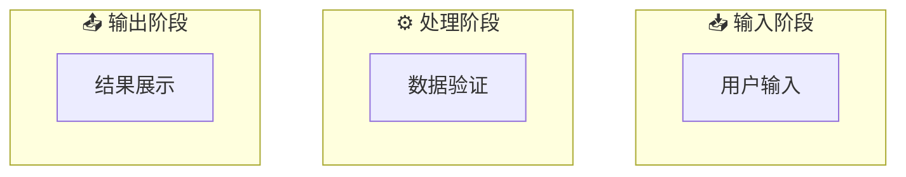
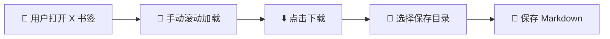
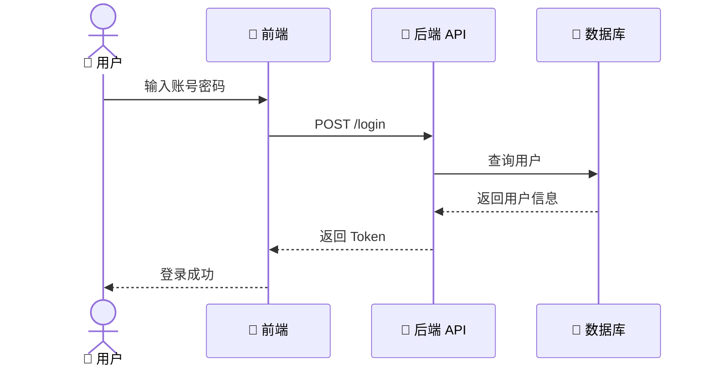

# Mermaid Generator

将任意文本、描述、工作流转换为清晰简约的 Mermaid 图表。

## 核心能力

1. **智能识别结构** - 从文本中提取逻辑关系和流程步骤
2. **多图表类型** - 支持 flowchart、sequence、class diagram
3. **清晰简约** - 使用 emoji 和图标增强可读性
4. **批量生成** - 复杂逻辑可拆分为多个关联图表
5. **自动分类保存** - 按 MMDD-主题 分文件夹保存

## 支持的图表类型

| 类型      | 适用场景                     | 触发词           |
| --------- | ---------------------------- | ---------------- |
| Flowchart | 工作流程、决策树、系统流程   | 流程图、工作流   |
| Sequence  | 时序交互、API 调用、用户旅程 | 时序图、交互流程 |
| Class     | 系统架构、数据模型、类关系   | 架构图、类图     |

## 工作流程

### 第一步：分析输入内容

识别：

- **内容类型**：工作流/交互流程/系统架构
- **核心实体**：主要角色/系统/模块
- **逻辑关系**：顺序/分支/循环/依赖
- **复杂度**：是否需要拆分为多个图表

### 第二步：选择图表类型

**自动选择规则**：

- 顺序流程 + 分支决策 → Flowchart
- 多方交互 + 时间顺序 → Sequence
- 模块关系 + 继承组合 → Class

**用户可指定**：

```
用户：生成流程图
用户：用时序图展示
用户：创建类图
```

### 第三步：设计图表结构

**Flowchart 设计原则**：

- 使用 `flowchart LR/TB` 方向
- 节点命名简洁（中文 + emoji）
- 用 subgraph 分组相关步骤
- 决策点用菱形 `{}`
- 关键路径用粗箭头 `==>`

**Sequence 设计原则**：

- 参与者命名清晰
- 每步操作一句话描述
- 用 Note 补充关键信息
- 异步操作用虚线 `-->`

**Class 设计原则**：

- 类名用大驼峰
- 核心属性/方法简化展示
- 关系清晰（继承/组合/依赖）
- 用 note 说明设计意图

### 第四步：增强可读性

**使用 Emoji**：

```
📱 应用层
🔧 工具类
📊 数据层
🔐 安全模块
✅ 成功状态
❌ 失败状态
⚙️ 配置
🚀 启动
```

**颜色提示**（在 subgraph 中使用）：



### 第五步：保存文件

**目录结构**：

```
00 收件箱/画板/mermaid流程图/
└── MMDD-主题名/
    ├── 01-主流程图.md
    ├── 02-子流程图.md
    └── README.md  (索引说明)
```

**文件命名**：

- 单个图表：`MMDD-主题名.md`
- 多个图表：`MMDD-主题名/序号-子主题.md`

**文件内容模板**：

```markdown
# 主题名 - 图表类型

> 生成时间：YYYY-MM-DD
> 来源：[原文链接或描述]

## 图表说明

[一句话描述这个图表展示什么]

## Mermaid 代码

\`\`\`mermaid
[图表代码]
\`\`\`

## 要点说明

- 关键点 1
- 关键点 2
```

## 使用示例

### 示例 1：简单流程转换

**输入**：

```
把这个转为流程图：
1. 用户打开 X 书签页面
2. 手动滚动加载
3. 点击下载按钮
4. 选择保存目录
5. 保存为 Markdown 文件
```

**输出**：



### 示例 2：复杂系统拆分

**输入**：

```
生成播客处理工作流的流程图，包括：
- 获取更新
- 提取字幕
- 内容处理
- 保存飞书
- 生成图片
```

**输出**：生成 3 个图表

1. 主流程图（整体流程）
2. 内容处理子流程（详细步骤）
3. 数据流转图（系统架构）

### 示例 3：时序图生成

**输入**：

```
用时序图展示用户登录流程
```

**输出**：



## 最佳实践

### 图表简化原则

1. **一图一主题** - 不要在一个图里塞太多内容
2. **3-7 法则** - 每个 subgraph 3-7 个节点
3. **命名清晰** - 节点名称 3-5 个字
4. **适度使用 emoji** - 2-3 个关键位置即可

### 拆分策略

**何时拆分**：

- 节点数 > 15
- 有明显的子流程
- 涉及多个系统/角色
- 需要展示不同层次

**拆分方式**：

- 主流程 + 子流程
- 业务流程 + 技术实现
- 时序关系 + 模块关系

### 保存组织

**单个流程**：

```
00 收件箱/画板/mermaid流程图/0202-X推文处理.md
```

**多个流程**：

```
00 收件箱/画板/mermaid流程图/0202-播客处理工作流/
├── README.md           # 索引说明
├── 01-主流程.md        # 整体流程
├── 02-内容处理.md      # 子流程
└── 03-系统架构.md      # 架构图
```

## 图表质量检查

生成后自检：

**Flowchart**：

- [ ] 流程方向清晰（LR/TB）
- [ ] 决策点用菱形
- [ ] 有开始和结束
- [ ] 分支都有明确出口

**Sequence**：

- [ ] 参与者命名清晰
- [ ] 时间顺序正确
- [ ] 异步操作用虚线
- [ ] 重要信息有 Note

**Class**：

- [ ] 类名符合规范
- [ ] 关系类型正确
- [ ] 核心属性方法展示
- [ ] 有必要的 note 说明

## 触发方式

| 用户说法       | 触发 |
| -------------- | ---- |
| 生成流程图     | ✅   |
| 转为 mermaid   | ✅   |
| 画个图表       | ✅   |
| 可视化这个流程 | ✅   |
| 用时序图展示   | ✅   |
| 创建架构图     | ✅   |

## 参考资源

详细语法参考：`references/mermaid-syntax.md`
