# Mermaid 语法参考

Mermaid 核心图表类型的语法速查。

## Flowchart（流程图）

### 基础语法

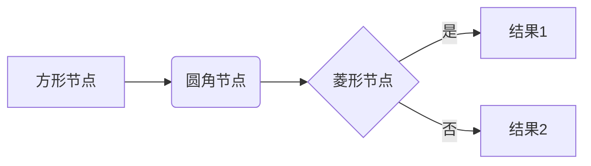

### 方向

- `LR` - 左到右
- `TB` / `TD` - 上到下
- `RL` - 右到左
- `BT` - 下到上

### 节点形状

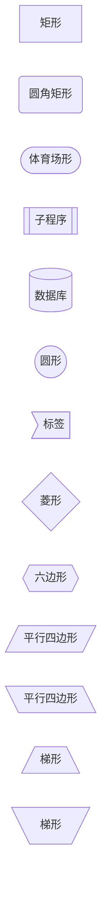

### 连接线

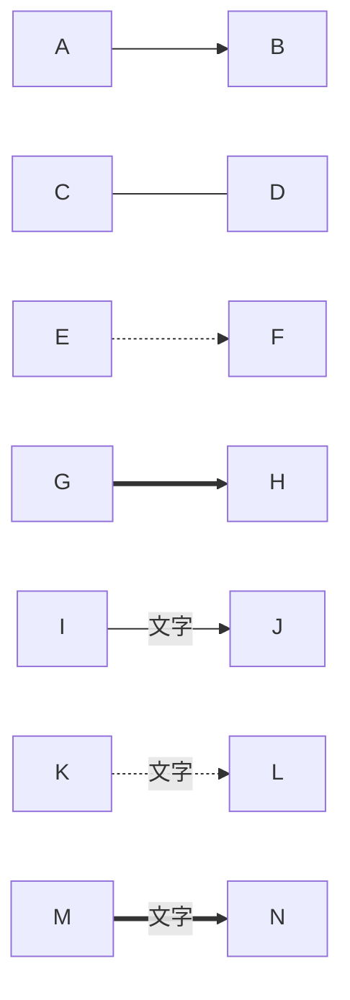

### Subgraph（分组）

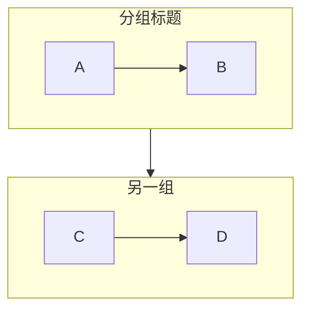

---

## Sequence Diagram（时序图）

### 基础语法

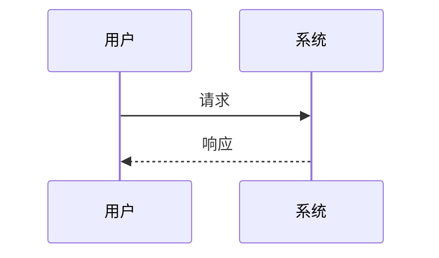

### 参与者

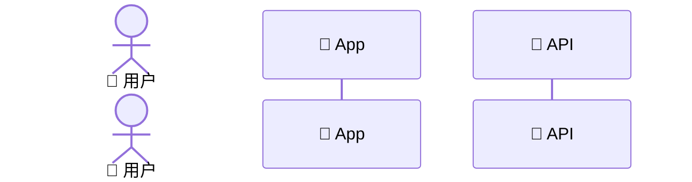

### 消息类型

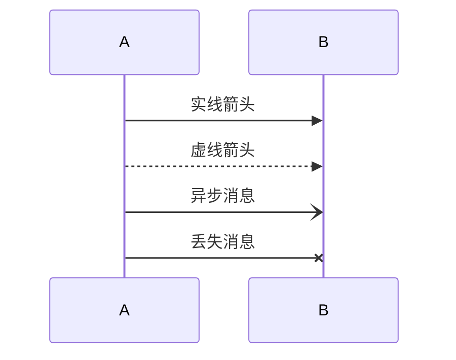

### 激活框

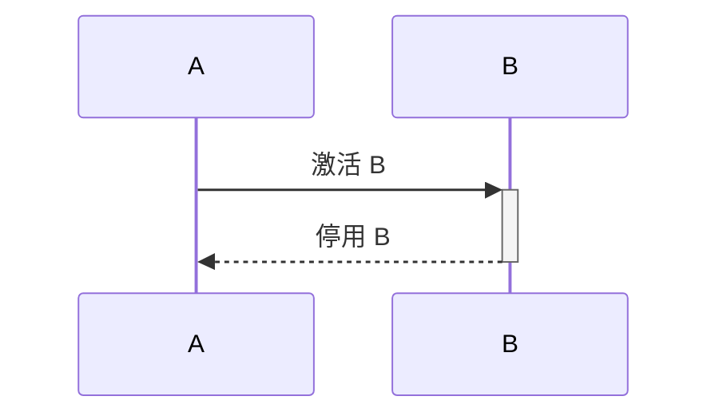

### 循环和条件

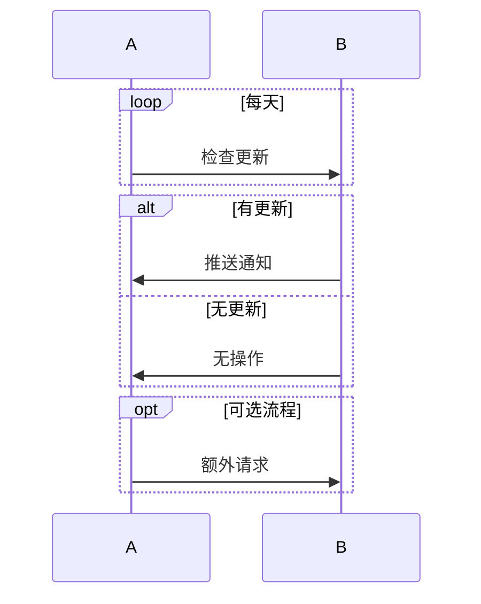

### Note

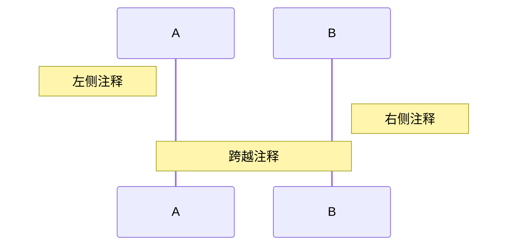

---

## Class Diagram（类图）

### 基础语法

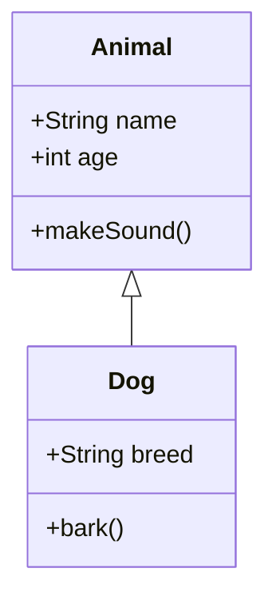

### 可见性

- `+` Public
- `-` Private
- `#` Protected
- `~` Package

### 关系类型

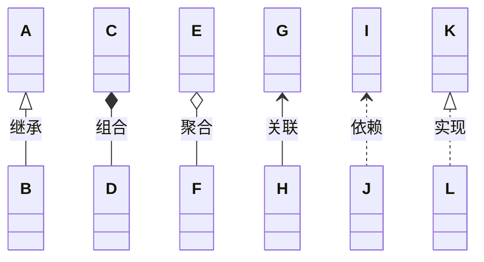

### 注解

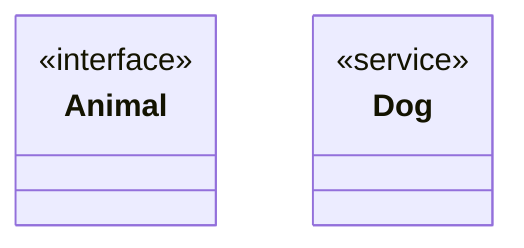

### Note

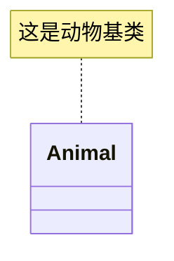

---

## 常用 Emoji

### 系统组件

- 📱 移动端
- 💻 PC 端
- 🌐 浏览器
- 🔧 后端服务
- 💾 数据库
- 📊 数据分析
- 🔐 安全模块
- ⚙️ 配置

### 流程阶段

- 📥 输入
- ⚙️ 处理
- 📤 输出
- 🚀 启动
- 🛑 停止
- ✅ 成功
- ❌ 失败
- ⚠️ 警告

### 操作动作

- 📝 编辑
- 🔍 搜索
- 📂 文件
- 📁 文件夹
- 🗂️ 归档
- 🔄 同步
- ⬇️ 下载
- ⬆️ 上传

### 用户角色

- 👤 用户
- 👨‍💼 管理员
- 🤖 机器人
- 👨‍💻 开发者
- 📞 客服

---

## 注意事项

### 避免的语法

❌ **不要使用空格**在节点 ID 中：

```
Bad: A[User Service]
Good: UserService[User Service]
```

❌ **不要在标签中使用裸露的括号**：

```
Bad: A -->|O(1) lookup| B
Good: A -->|"O(1) lookup"| B
```

❌ **避免保留关键字**作为节点 ID：

```
Bad: end[End]
Good: endNode[End]
```

### 最佳实践

✅ **Subgraph 使用显式 ID**：

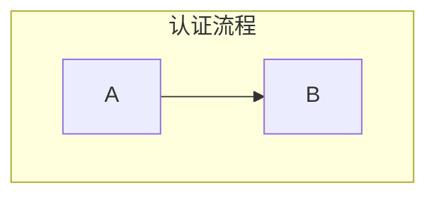

✅ **复杂标签用引号**：

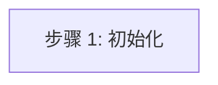

✅ **让主题处理颜色**（不要手动设置样式）：

```
Bad: style A fill:#fff
Good: 使用 subgraph 分组
```
